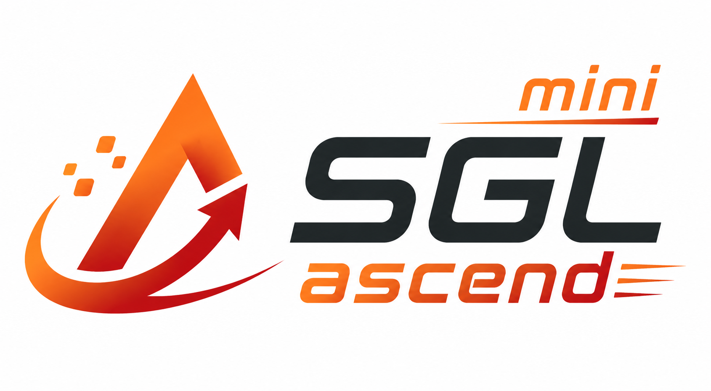

<p align="center">
  
</p>

# Mini-SGLang MetaX

`mini-sglang-metax` is a correctness-first Mini-SGLang port for MetaX
C500/C550 accelerators and the MACA software stack. It keeps the compact
Mini-SGLang architecture while replacing NVIDIA-only runtime assumptions with
explicit MetaX routing and portable PyTorch fallbacks.

The Python import name remains `minisgl` for compatibility with upstream code.
The distribution and project name is `mini-sglang-metax`.

For the full architecture, borrowed foundations, attribution, MetaX-owned
adaptation boundary, and validation model, read
[`PROVENANCE.md`](PROVENANCE.md). This project keeps upstream ideas and prior
Ascend reference work explicitly attributed rather than presenting them as
new MetaX inventions.

## Current status

**Status: MetaX technical preview, real-hardware offline Gate 0 and bounded
online Gate 1.2 paths passed.**

| Area | Validated result |
| --- | --- |
| Hardware | MetaX C500 and C550 visible through vendor `torch.cuda` API |
| Vendor PyTorch | `2.10.0+metax3.8.1.0` |
| Real model | Qwen3-8B BF16, TP1, eager, `torch_native` attention |
| Repeated requests | Two deterministic greedy requests in one live `LLM` instance |
| Cache invariant | `512/512` KV tokens available after each real-model request |
| Multi-card transport | TP2 NCCL/MCCL-compatible all-reduce passed |
| Framework TP coverage | Synthetic Qwen3 TP2 and TP8 end-to-end passed |
| Online server | TP1 Gate 1.2: 24/24 bounded requests, overload queueing, fault recovery, actual scheduler batching, and cleanup passed on C550 |
| Vendor attention | MetaX `flashinfer` TP1 Gate 1 passed after signature compatibility fixes; explicit opt-in only |

Real-model evidence is recorded in
[`docs/metax_port/gate0_verdict.md`](docs/metax_port/gate0_verdict.md). Online
evidence is recorded in
[`docs/metax_port/online_gate1_verdict.md`](docs/metax_port/online_gate1_verdict.md)
and
[`docs/metax_port/online_gate1_1_verdict.md`](docs/metax_port/online_gate1_1_verdict.md),
with Gate 1.2 evidence in
[`docs/metax_port/online_gate1_2_verdict.md`](docs/metax_port/online_gate1_2_verdict.md).
Public-release scope and remaining blockers are summarized in
[`docs/metax_port/open_source_readiness.md`](docs/metax_port/open_source_readiness.md).

## Why a MetaX-specific project

MetaX vendor PyTorch exposes devices through `torch.cuda`, but that does not
make every NVIDIA binary or kernel API compatible. Upstream Mini-SGLang assumes
FlashInfer, `sgl_kernel`, CUDA Graph, PyNCCL, and NVIDIA architecture probes in
several hot paths.

The three accelerator routes in this repository are intentionally distinct:

| Route | PyTorch device surface | Vendor software/collectives | Project routing contract |
| --- | --- | --- | --- |
| NVIDIA | `torch.cuda` | CUDA and NCCL | `platform=nvidia`; upstream NVIDIA-oriented fused backends may be selected when installed |
| Huawei Ascend | `torch.npu` after `torch_npu` import | CANN and HCCL | `platform=ascend`; NPU runtime dispatch and the explicit `npu_fia` backend are separate compatibility paths |
| MetaX | vendor `torch.cuda` compatibility surface | MACA and MCCL | `platform=metax`; eager `torch_native` is the default, with the installed MetaX `flashinfer` package available only by explicit opt-in |

This table describes framework routing, not binary compatibility or a
performance comparison. MetaX is not treated as an NVIDIA device merely
because its PyTorch API is CUDA-facing, and the Ascend `torch_npu`/HCCL/FIA
implementation is not reused as the MetaX backend.

This project separates two concepts:

- **Device API:** `cuda`, because MACA vendor PyTorch intentionally preserves
  the CUDA-facing PyTorch contract.
- **Accelerator platform:** `metax`, detected independently so the framework
  can avoid NVIDIA-only kernel and graph choices.

The current bring-up path uses:

- eager execution;
- BF16 dense Qwen models;
- portable `torch_native` attention;
- an explicit, experimental MetaX `flashinfer` attention option while
  `torch_native` remains the default correctness path;
- PyTorch implementations for activation, norm, RoPE, embedding, and greedy
  sampling where the upstream fused path is NVIDIA-specific;
- vendor `torch.distributed` collectives for TP2/TP8;
- CUDA Graph and PyNCCL disabled until separately validated.

The MetaX-specific engineering work is therefore concrete rather than a
rename:

1. Detect the accelerator vendor independently from `tensor.device.type`, so
   CUDA-facing MetaX tensors select `platform=metax` instead of NVIDIA kernels.
2. Route activation, normalization, rotary embedding, embedding, attention,
   and sampling around NVIDIA-only fused operators when running on MetaX.
3. Keep a readable eager PyTorch correctness path while preserving the vendor
   PyTorch installation and its device/allocator behavior.
4. Use the vendor `torch.distributed` compatibility layer for validated
   collectives instead of assuming the upstream PyNCCL wrapper is portable.
5. Adapt optional MetaX `flashinfer` wrapper calls to the signatures actually
   installed on the target, without making that experimental backend default.
6. Validate the result with real Qwen3-8B requests, KV-cache recovery, HTTP/SSE
   cancellation, scheduler batching, bounded overload, and failure recovery on
   C500/C550 hardware.

## Quick start on MetaX

### 1. Use the vendor image

The target image must already contain a matching MACA PyTorch build. Do not
replace the vendor `torch` wheel with a public PyPI wheel.

```bash
cd /path/to/mini-sglang-metax

export MINISGL_PLATFORM=metax
export MACA_PATH=/opt/maca
export CUDA_HOME=/opt/maca/tools/cu-bridge
export CUDA_PATH="$CUDA_HOME"
export CUCC_PATH="$CUDA_HOME"
export PYTHONPATH=python
```

For editable installation in a vendor image, preserve the existing PyTorch:

```bash
python -m pip install -e . --no-deps
```

### 2. Run the hardware preflight

```bash
python scripts/metax/preflight.py
```

The preflight checks platform detection, device visibility, BF16 GEMM, and the
portable attention micro-path.

### 3. Reproduce the validated real-model Gate 0 case

```bash
export MODEL_PATH=/path/to/Qwen3-8B
export SW_HOME=/persistent/path/${USER}

bash scripts/metax/run_gate0.sh
```

The default Gate 0 run is TP1, eager BF16, four greedy output tokens, two
requests in one process, and 512 KV-cache pages. Results are written under:

```text
${SW_HOME}/results/mini-sglang-metax/<date>/
```

### 4. Reproduce the bounded online Gate 1 case

The online path requires the declared `msgpack`, `pyzmq`, FastAPI, and Uvicorn
dependencies. Preserve the vendor PyTorch installation when adding them.

```bash
export MODEL_PATH=/path/to/Qwen3-8B
export SW_HOME=/persistent/path/${USER}

bash scripts/metax/run_online_gate1.sh
```

The script starts an isolated process group, waits for backend readiness,
checks `/v1/models`, sends two deterministic non-streaming OpenAI chat
requests, validates the JSON responses, and always tears down the service.

### 5. Reproduce streaming, cancellation, and concurrent Gate 1.1

```bash
export MODEL_PATH=/path/to/Qwen3-8B
export SW_HOME=/persistent/path/${USER}

bash scripts/metax/run_online_gate1_1.sh
```

Gate 1.1 additionally validates the complete SSE sequence, deliberately
disconnects a live stream and requires its AbortAck, sends four simultaneous
ragged requests, verifies a final recovery request, and checks clean shutdown.

### 6. Reproduce bounded soak, queueing, and batch observability Gate 1.2

```bash
export MODEL_PATH=/path/to/Qwen3-8B
export SW_HOME=/persistent/path/${USER}

bash scripts/metax/run_online_gate1_2.sh
```

The default profile runs 3 rounds of 8 simultaneous requests against a server
limited to 2 running requests, injects malformed input and a live disconnect,
then requires a recovery request and server-side multi-request batch evidence.

For the bounded experimental vendor-attention probe:

```bash
ATTENTION_BACKEND=fi RESULT_PREFIX=online_gate1_fi_probe \
  bash scripts/metax/run_online_gate1.sh
```

### 7. Run a bounded TP smoke

Use a model whose query and KV head counts are compatible with the requested
tensor-parallel size.

```bash
TP=2 MODEL_PATH=/path/to/model bash scripts/metax/run_gate0.sh
TP=8 MODEL_PATH=/path/to/tp8-compatible-model bash scripts/metax/run_gate0.sh
```

## Validated real-model result

The C500 host ran Qwen3-8B BF16 from a read-only mounted model store:

```text
/path/to/Qwen3-8B
```

Observed result:

- load completed successfully;
- post-rebrand model load: `14.7772 s`;
- request 1: `2.2605 s`, tokens `[25010, 10, 4999, 1725]`;
- request 2: `0.1823 s`, identical tokens;
- KV availability returned to `512/512` after both requests;
- clean process exit code `0`.

These timings were collected by `mini-sglang-metax/scripts/metax/run_gate0.sh`
after the model files were warm in the filesystem cache. They are functional
evidence, not a performance comparison.

## Project layout

```text
python/minisgl/                 Framework implementation (import name unchanged)
python/minisgl/utils/platform.py
                                CUDA-facing platform detection for MetaX
python/minisgl/attention/torch_native.py
                                Portable eager attention backend
scripts/metax/preflight.py      Device and operator preflight
scripts/metax/run_gate0.sh      Persistent, report-producing Gate 0 entry point
scripts/metax/run_tiny_e2e.py   Offline TP1/TPn repeated-request driver
scripts/metax/run_online_gate1.sh
                                Bounded TP1 HTTP/ZMQ and OpenAI API smoke
scripts/metax/run_online_gate1_1.sh
                                SSE, cancellation/Ack, concurrency, recovery
scripts/metax/run_online_gate1_2.sh
                                Bounded soak, overload queueing, faults, batching
scripts/metax/online_gate1_client.py
                                Standard-library extended online client
scripts/metax/batch_observability.py
                                Parses actual SchedulerBatch records
scripts/metax/vendor_inventory.py
                                Device and vendor attention package inventory
docs/metax_port/                Plans, evidence, verdicts, and reports
REPORT.md                       Management/Jira-ready project summary
PROVENANCE.md                   Source lineage and retained compatibility boundary
```

## Support boundary

Validated now:

- MetaX C500;
- MetaX C550;
- vendor PyTorch `2.10.0+metax3.8.1.0`;
- dense Qwen3 BF16;
- eager execution;
- TP1 real-model inference;
- TP2/TP8 functional transport and synthetic-model inference;
- deterministic greedy sampling and repeated-request cache recovery;
- TP1 HTTP/ZMQ service startup, model listing, repeated non-streaming OpenAI
  chat requests, and clean shutdown;
- SSE finish and `[DONE]` delivery, client disconnect plus AbortAck, four
  simultaneous ragged chat requests, and post-cancel recovery;
- bounded Gate 1.2 with 24/24 completions, offered concurrency 8 against
  running limit 2, scheduler backlog 6, and 99 actual multi-request batches;
- experimental MetaX `flashinfer` TP1 Gate 1 with real Qwen3-8B weights.

Not yet claimed:

- production readiness;
- multi-hour soak, sustained production load, HTTP load shedding, and TP2+
  online-service coverage;
- CUDA Graph;
- PyNCCL/MCCL wrapper parity beyond vendor `torch.distributed`;
- MoE, quantized checkpoints, automatic vendor-attention selection, or direct
  `mcoplib` paged-attention integration;
- throughput or latency leadership over SGLang, vLLM, or other frameworks.

## Verification

Focused host-independent checks:

```bash
pytest -q -o addopts="" tests/misc/test_platform.py
pytest -q -o addopts="" tests/misc/test_torch_native_attention.py
pytest -q -o addopts="" tests/misc/test_pyproject_config.py
pytest -q -o addopts="" \
  tests/misc/test_scheduler_sync_all_ranks.py \
  -k scheduler_io_import_does_not_require_msgpack
```

Real hardware verification must use the scripts under `scripts/metax/` and
must preserve the vendor runtime.

## Contributing and security

See [`CONTRIBUTING.md`](CONTRIBUTING.md) for the portable test matrix and
hardware-evidence requirements. Report vulnerabilities according to
[`SECURITY.md`](SECURITY.md), and never attach private infrastructure logs or
model artifacts to a public issue.

## Attribution and license

This project is derived from
[`sgl-project/mini-sglang`](https://github.com/sgl-project/mini-sglang) and
retains its MIT license. The earlier Ascend adaptation was used as a device
abstraction and validation reference; its historical evidence remains under
`docs/ascend_port/` but is not the current product surface and must not be read
as MetaX compatibility evidence.

MetaX, MACA, MCCL, and vendor PyTorch are external platform dependencies and
are not implemented or redistributed by this repository.
