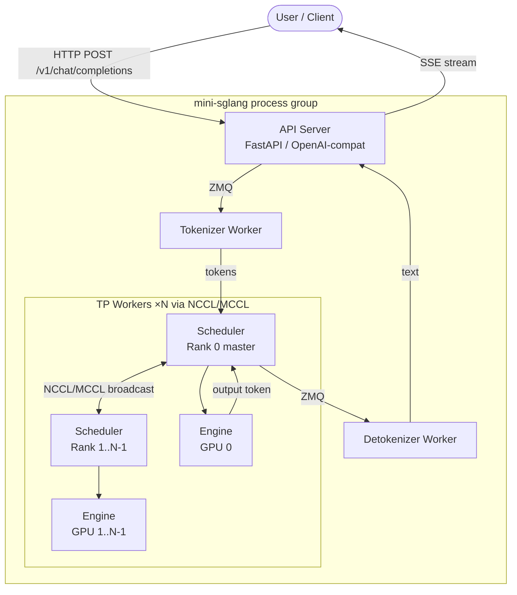
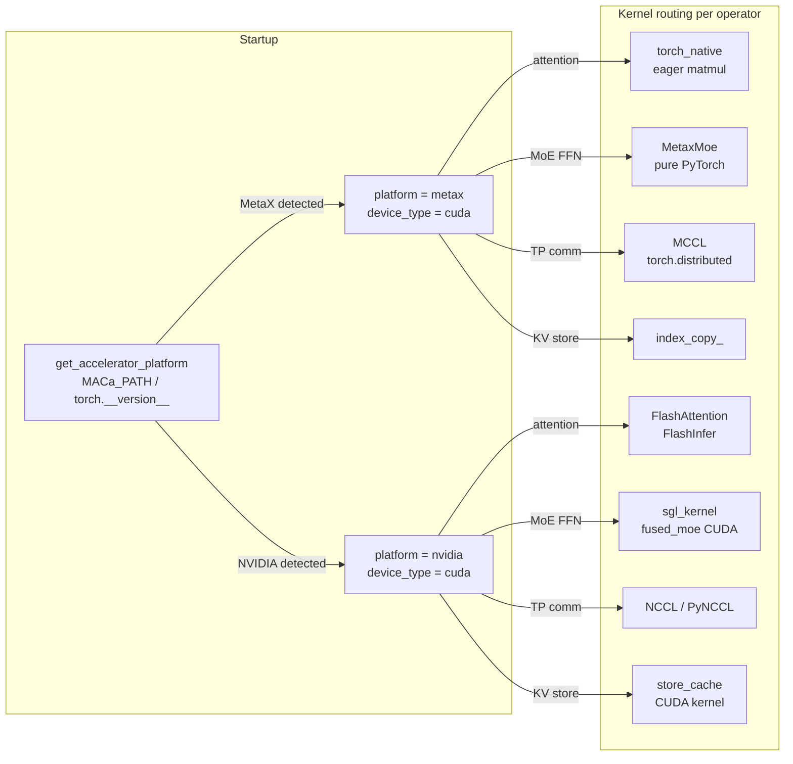
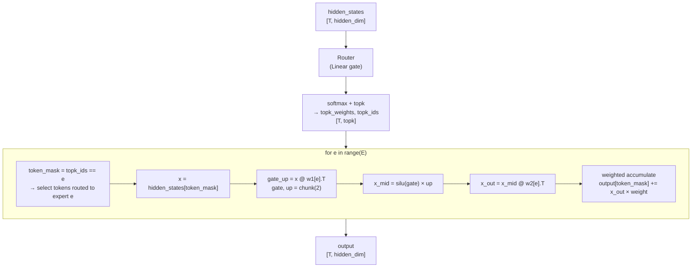
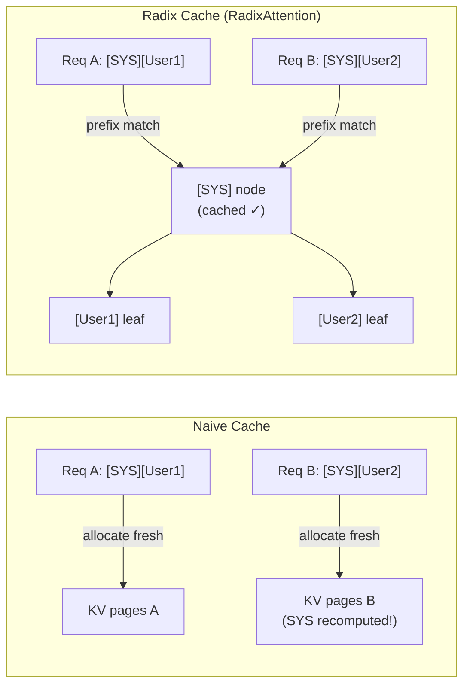
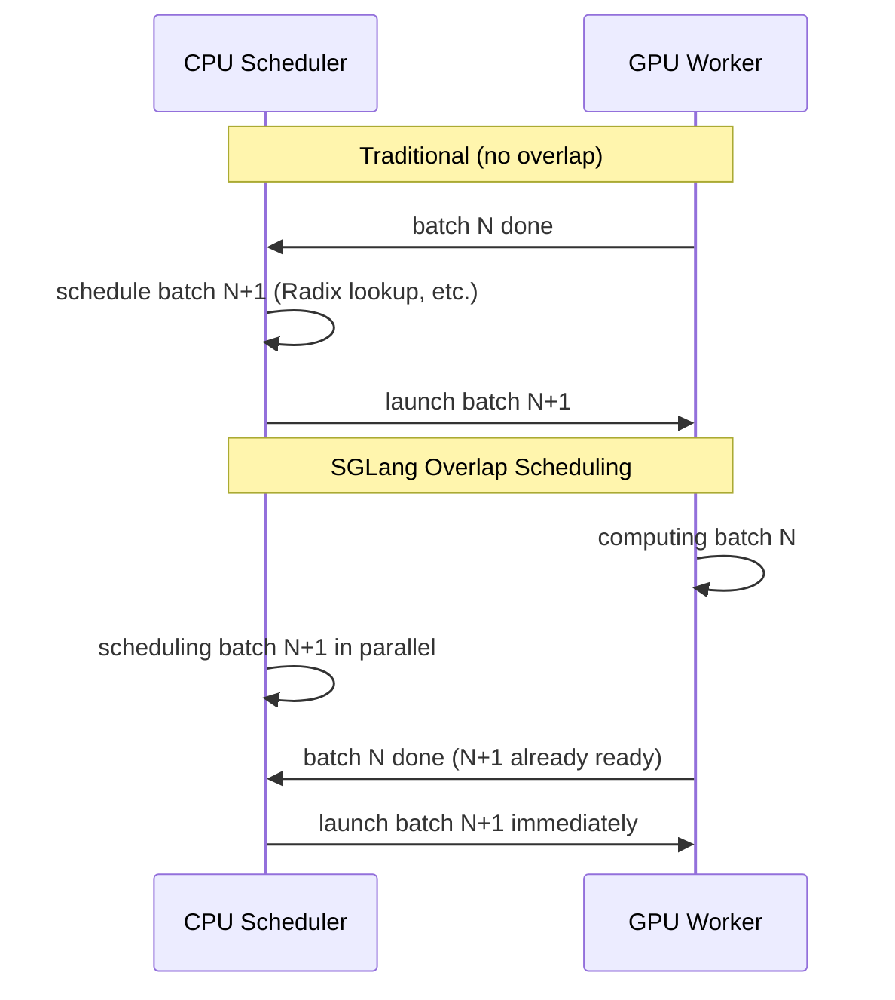
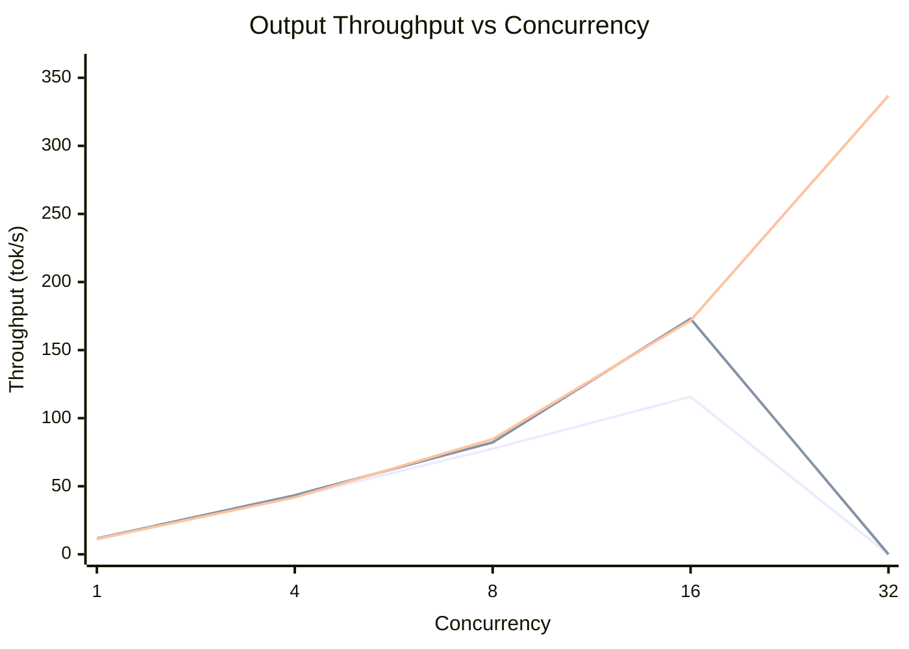

# Diagrams — mini-sglang-metax

Mermaid source for all architecture and flow diagrams used in docs and README.

---

## 1. System Architecture



---

## 2. platform / device_type Decoupling



---

## 3. MetaxMoe M1 — Expert Routing Flow



---

## 4. KV Cache: Naive vs Radix



---

## 5. Chunked Prefill vs Naive

```mermaid
gantt
    title GPU Timeline — Prefill 32K tokens + 4 Decode steps
    dateFormat X
    axisFormat %s

    section Naive
    Prefill 32K          :p1, 0, 8
    Decode 1             :d1, 8, 9
    Decode 2             :d2, 9, 10
    Decode 3             :d3, 10, 11
    Decode 4             :d4, 11, 12

    section Chunked Prefill (chunk=8K)
    Prefill chunk 1      :c1, 0, 2
    Decode interleave 1  :e1, 2, 3
    Prefill chunk 2      :c2, 3, 5
    Decode interleave 2  :e2, 5, 6
    Prefill chunk 3      :c3, 6, 8
    Decode interleave 3  :e3, 8, 9
    Prefill chunk 4      :c4, 9, 11
    Decode interleave 4  :e4, 11, 12
```



---

## 6. Overlap Scheduling



---

## 7. Benchmark: Throughput vs Concurrency（实测）

> Qwen3-30B-A3B.w8a8 | 8×MetaX C500 | SGLang 0.5.13+maca3.8.1.0



*注：prefill-heavy 和 decode-heavy 只测到 conc=16（混合场景则测到 conc=32）*

### 数据表（ASCII 可视化）

```
           Output Throughput (tok/s) — 实测
                                              Prefill-heavy (in=1024,out=16)  ■
 337 ┤                            ░░░          Decode-heavy  (in=64, out=256)  ▒
     │                           ░░░░░         Mixed PD      (in=512, out=128) ░
 250 ┤                          ░░░░░░░
     │
 173 ┤                    ▒▒▒░░░
 172 ┤                   ▒▒▒▒░░░░
     │
 116 ┤             ■■■░░░
  85 ┤          ■■■▒▒▒░░░
  78 ┤         ■■■▒▒▒░░░░
     │
  43 ┤    ■▒░░░
  42 ┤    ■▒▒░░
  11 ┤ ■▒░
     └──────────────────────────────────
        1    4    8    16           32
```
